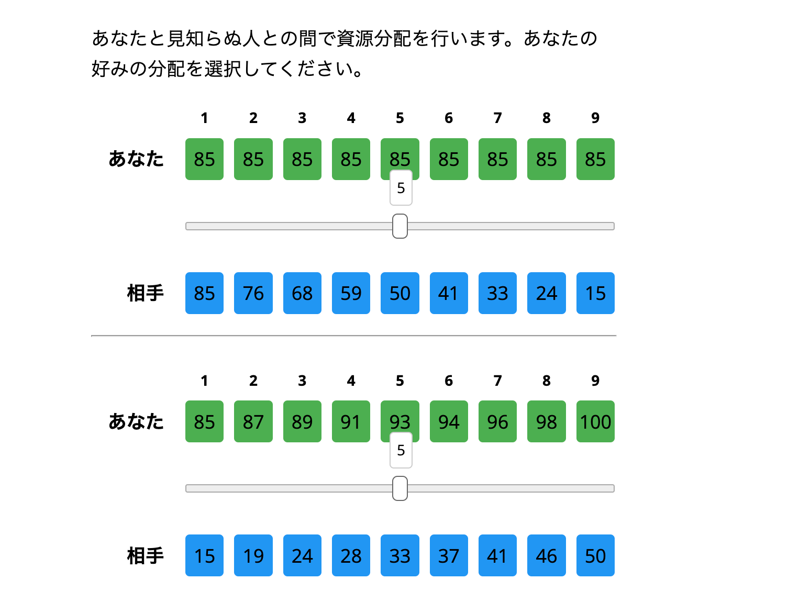
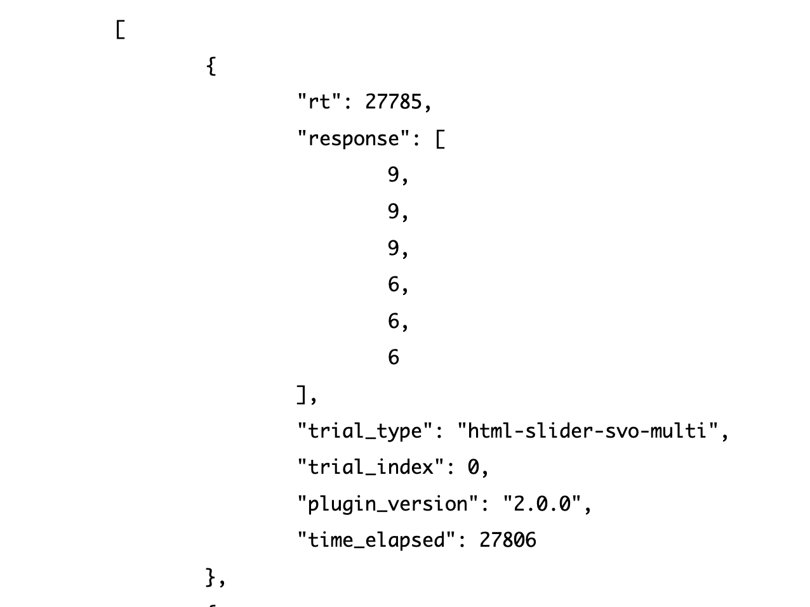

# jsPsychでSVO Slider Measure (Murphy et al., 2011) を実施するプラグイン

[English Version](https://github.com/kscscr/jsPsych-SVO-Slider/blob/main/README.md)

## プログラムについて
"plugin-html-slider-svo-multi.js"は、jsPsychでSVO Slider Measure (Murphy et al., 2011)を実施するためのプラグインです。このプログラムは、plugin-html-slider-response.jsを基に作成しました。

### デモ
[https://experiment.kscscr.com/Demo/SVO/jspsych-html-slider-SVO-Multi-ja.html](https://experiment.kscscr.com/Demo/SVO/jspsych-html-slider-SVO-Multi-ja.html)

### イメージ

画像のように、実際のスライダーを用いて、SVO Sliderに回答することができます。


回答データは、responseに配列の形で保存されます。

## 使い方
### ファイルの配置
以下の2つのファイルを、distフォルダに配置する。
- Plugins: plugin-html-slider-svo-multi.js
- CSS: svo.css

### プログラムの実行方法
headタグに以下の記述を追加する。
```
<script src="dist/plugin-html-slider-svo-multi.js"></script>
<link rel="stylesheet" href="svo.css">
```

実験の実施方法は次の通り。
- questions:stimulus_upperとstimulus_lowerに、それぞれ9個の配列を設置する。
- require_movement: スライダーを一度動かさないと、次の画面に進めないようにする
- prompt: 質問の文章。
- slider_width: 500px以下で指定可能。
- label_upper/label_lower：上のラベルと下のラベル

```
var trial = {
      type: jsPsychHtmlSliderSVOMulti,
      questions: [
        {
          stimulus_upper: [85, 85, 85, 85, 85, 85, 85, 85, 85], 
          stimulus_lower: [85, 76, 68, 59, 50, 41, 33, 24, 15]
        }, 
        {
          stimulus_upper: [85, 87, 89, 91, 93, 94, 96, 98, 100], 
          stimulus_lower: [15, 19, 24, 28, 33, 37, 41, 46, 50]
        },
        {
          stimulus_upper: [50, 54, 59, 63, 68, 72, 76, 81, 85], 
          stimulus_lower: [100, 98, 96, 94, 93, 91, 89, 87, 85]
        }, 

        {
          stimulus_upper: [50, 54, 59, 63, 68, 72, 76, 81, 85], 
          stimulus_lower: [100, 89, 79, 68, 58, 47, 36, 26, 15]
        },
        {
          stimulus_upper: [100, 94, 88, 81, 75, 69, 63, 56, 50], 
          stimulus_lower: [50, 56, 63, 69, 75, 81, 88, 94, 100]
        }, 
        {
          stimulus_upper: [100, 98, 96, 94, 93, 91, 89, 87, 85], 
          stimulus_lower: [50, 54, 59, 63, 68, 72, 76, 81, 85]
        },
      ],
      require_movement: true,
      label_upper: "You</br>receive", 
      label_lower: "Other</br>receive", 
      slider_width: 500,
      prompt: '<p>You will allocate resources between yourself and others. </br>Please select the option that best matches your preference.</p>'
};
```
回答データは、survey-multi-choiceプラグインなどと同様に、配列の形で保存される。


## 免責事項や連絡先
本プログラムの使用により生じたいかなる損害や不利益について一切その責任を負いません。自己責任のもとで利用してください。

バグを発見した際には、以下の連絡先に報告してもらえると助かります。
- X(Twitter): [@kscscr](https://x.com/kscscr)
- メールアドレス：ks1760osakasg[at]gmail.com

## Citation
Murphy, R. O., Ackermann, K. A., & Handgraaf, M. J. (2011). Measuring social value orientation. Judgment and Decision making, 6(8), 771-781.

## ライセンス
The MIT License (MIT)

Copyright (c) 2014-2022 Joshua R. de Leeuw

Permission is hereby granted, free of charge, to any person obtaining a copy
of this software and associated documentation files (the "Software"), to deal
in the Software without restriction, including without limitation the rights
to use, copy, modify, merge, publish, distribute, sublicense, and/or sell
copies of the Software, and to permit persons to whom the Software is
furnished to do so, subject to the following conditions:

The above copyright notice and this permission notice shall be included in all
copies or substantial portions of the Software.

THE SOFTWARE IS PROVIDED "AS IS", WITHOUT WARRANTY OF ANY KIND, EXPRESS OR
IMPLIED, INCLUDING BUT NOT LIMITED TO THE WARRANTIES OF MERCHANTABILITY,
FITNESS FOR A PARTICULAR PURPOSE AND NONINFRINGEMENT. IN NO EVENT SHALL THE
AUTHORS OR COPYRIGHT HOLDERS BE LIABLE FOR ANY CLAIM, DAMAGES OR OTHER
LIABILITY, WHETHER IN AN ACTION OF CONTRACT, TORT OR OTHERWISE, ARISING FROM,
OUT OF OR IN CONNECTION WITH THE SOFTWARE OR THE USE OR OTHER DEALINGS IN THE
SOFTWARE.
